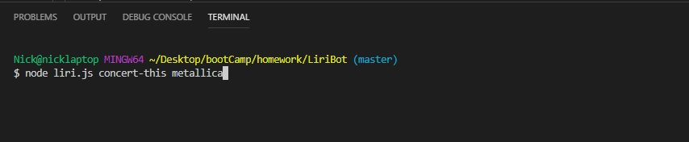
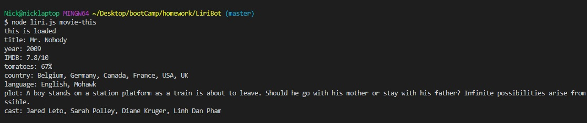
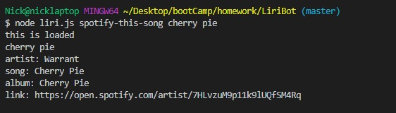

# LiriBot

node application that uses apis to provide information about a song movie or concert

##technologies used
javascript
nodejs
axios
spotify api
bandsintown api
omdb api
clear

## how to use
after installing axios and spotify npms
simply type: node liri.js "action you wish to take" "item to search for"
you can search for concerts with concert-this

that will return something like this

you can use movie-this to search for movies

if left blank this will default to mr nobody

spotify-this-song and a song title will return a song of the given name with information about it

